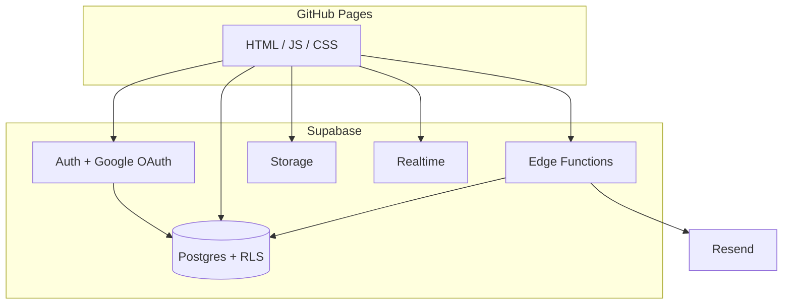
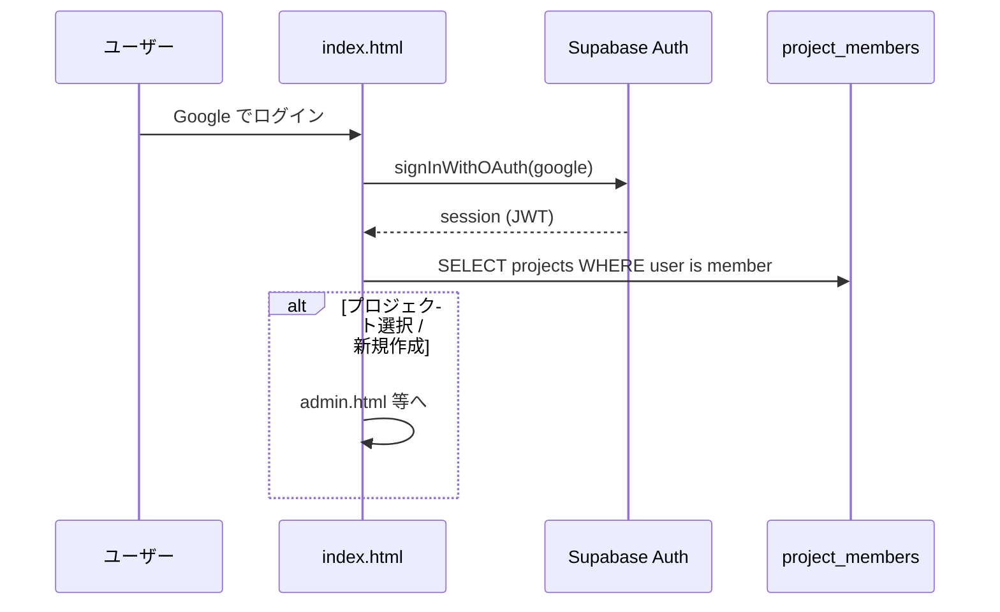
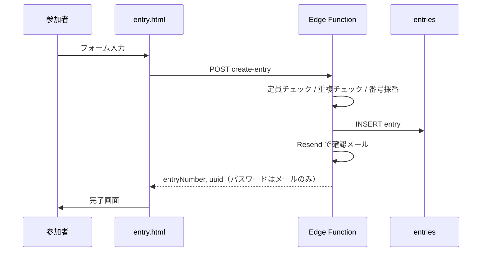
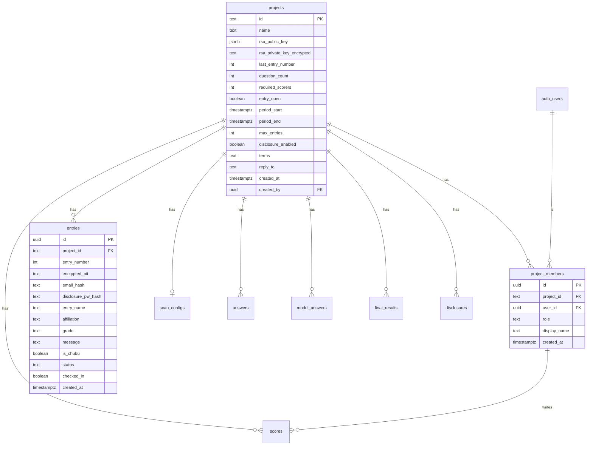

# CIQ Supabase 移行 — Phase 0 設計書

> **確定方針（2026-04）**
> - DB / Auth / Storage / サーバー処理 → **Supabase**
> - フロント配信 → **GitHub Pages**（現状維持）
> - メール → **Resend**（Supabase Edge Functions 経由、キーはサーバー側のみ）
> - 運営・採点者ログイン → **Google OAuth**
> - 参加者 → **アカウント不要**（受付番号 + パスワード）
> - Firebase / AWS SES / Lambda → 移行完了後に廃止
> - **Vercel は使わない**

---

## 1. 脅威モデル

### 絶対に防ぐこと

| ID | 脅威 | 現状（Firebase） | 移行後の対策 |
|----|------|------------------|--------------|
| T1 | 外部者が答案画像・採点結果を読む | 匿名 Auth で全 read 可能 | RLS + Storage ポリシー |
| T2 | 外部者が採点結果を改ざん | 同上 | RLS（scorer/admin のみ write） |
| T3 | 参加者 PII の漏洩 | RSA 暗号化（効果はある） | 暗号化維持 + 復号は Edge Function 限定 |
| T4 | 他大会のデータへのアクセス | projectId さえ知れば可能 | RLS で `project_members` 必須 |
| T5 | エントリー偽造・大量 spam | 直接 write 可能 | Edge Function + レート制限 |
| T6 | メール API キー漏洩 | フロントに平文 | Resend キーは Edge Function のみ |

### 信頼境界

```
[参加者ブラウザ]  ──公開API──▶  Edge Functions  ──▶  DB / Resend
[採点者/運営]     ──Google──▶  Supabase Auth    ──RLS──▶  DB / Storage
[GitHub Pages]    静的ファイルのみ（秘密情報なし）
```

---

## 2. アーキテクチャ



### クライアントが直接触ってよいもの

| 操作 | 方式 |
|------|------|
| 運営・採点者の CRUD | Supabase JS + RLS（Google セッション） |
| リアルタイム採点 | Realtime on `scores` 等 |
| 答案画像アップロード | Storage signed upload または Function 経由 |
| エントリー作成 | **Edge Function のみ** |
| キャンセル / 成績照会 | **Edge Function**（パスワード検証） |
| メール送信 | **Edge Function のみ** |

---

## 3. 認証フロー

### 3-1. 運営・採点者（Google）



**変更点（現 Firebase 比較）**

| 現状 | 移行後 |
|------|--------|
| プロジェクト ID + パスワード + 表示名 | Google アカウント |
| `secretHash` / `adminHash` を localStorage | 不要 |
| 管理者 RSA 秘密鍵を localStorage | **サーバー側保管**（後述） |
| 採点者名は自由入力 | `project_members.display_name` |

**ロール**

| role | 権限 |
|------|------|
| `owner` | 全操作 + メンバー管理 + プロジェクト削除 |
| `admin` | 全運営操作 + 不一致確定 + PII 復号 |
| `scorer` | 採点 read/write、答案閲覧 |

### 3-2. プロジェクト作成（Google 必須）

1. Google ログイン済みユーザーが「新規作成」
2. Edge Function `create-project` を呼ぶ
   - RSA 鍵ペア生成
   - 公開鍵 → `projects.rsa_public_key`
   - 秘密鍵 → `projects.rsa_private_key_encrypted`（アプリマスター鍵で AES 暗号化、Supabase Secret に保存）
   - 作成者を `project_members(role=owner)` に追加
3. **採点者用の共有パスワードは廃止**（Google 招待制）

### 3-3. 採点者の追加

| 方式 | 説明 |
|------|------|
| **A. メール招待（推奨）** | owner が Google メールを入力 → `project_members` に pre-register → 該当ユーザーがログインすると自動参加 |
| **B. 招待リンク** | ワンタイムトークン付き URL（Edge Function で検証） |

### 3-4. 参加者（公開ページ）

**Google ログイン不要**



**成績照会・キャンセル・編集** も同様に Edge Function が `email_hash + disclosure_pw_hash` を検証。

---

## 4. データベーススキーマ

### 4-1. ER 概要



### 4-2. テーブル定義（SQL 草案）

```sql
-- ── プロジェクト ──────────────────────────
CREATE TABLE projects (
  id              TEXT PRIMARY KEY,          -- 例: ciq26
  name            TEXT NOT NULL,
  rsa_public_key  JSONB NOT NULL,
  rsa_private_key_encrypted TEXT NOT NULL,   -- AES(APP_ENCRYPTION_KEY)
  last_entry_number INT NOT NULL DEFAULT 0,
  question_count  INT NOT NULL DEFAULT 100,
  required_scorers INT NOT NULL DEFAULT 3,
  entry_open      BOOLEAN NOT NULL DEFAULT FALSE,
  period_start    TIMESTAMPTZ,
  period_end      TIMESTAMPTZ,
  max_entries     INT NOT NULL DEFAULT 0,    -- 0 = 無制限
  disclosure_enabled BOOLEAN NOT NULL DEFAULT FALSE,
  terms           TEXT,
  reply_to        TEXT,
  created_at      TIMESTAMPTZ NOT NULL DEFAULT now(),
  created_by      UUID NOT NULL REFERENCES auth.users(id)
);

-- ── メンバー（Google ユーザー） ─────────────
CREATE TABLE project_members (
  id            UUID PRIMARY KEY DEFAULT gen_random_uuid(),
  project_id    TEXT NOT NULL REFERENCES projects(id) ON DELETE CASCADE,
  user_id       UUID NOT NULL REFERENCES auth.users(id) ON DELETE CASCADE,
  role          TEXT NOT NULL CHECK (role IN ('owner', 'admin', 'scorer')),
  display_name  TEXT NOT NULL,               -- 採点時の表示名
  invited_email TEXT,                        -- 未登録ユーザーの事前招待
  created_at    TIMESTAMPTZ NOT NULL DEFAULT now(),
  UNIQUE (project_id, user_id)
);

-- ── エントリー ────────────────────────────
CREATE TABLE entries (
  id                  UUID PRIMARY KEY DEFAULT gen_random_uuid(),
  project_id          TEXT NOT NULL REFERENCES projects(id) ON DELETE CASCADE,
  entry_number        INT NOT NULL,
  encrypted_pii       TEXT NOT NULL,
  email_hash          TEXT NOT NULL,
  disclosure_pw_hash  TEXT NOT NULL,
  entry_name          TEXT,
  affiliation         TEXT,
  grade               TEXT,
  message             TEXT,
  is_chubu            BOOLEAN NOT NULL DEFAULT FALSE,
  status              TEXT NOT NULL DEFAULT 'registered'
                      CHECK (status IN ('registered', 'waitlist', 'canceled', 'late')),
  checked_in          BOOLEAN NOT NULL DEFAULT FALSE,
  created_at          TIMESTAMPTZ NOT NULL DEFAULT now(),
  UNIQUE (project_id, entry_number)
);
CREATE INDEX entries_email_hash_idx ON entries (project_id, email_hash);
CREATE INDEX entries_status_idx ON entries (project_id, status);

-- ── スキャン設定（旧 config） ─────────────
CREATE TABLE scan_configs (
  project_id  TEXT PRIMARY KEY REFERENCES projects(id) ON DELETE CASCADE,
  config      JSONB NOT NULL                 -- tomobo, markCells, answerRegions, ...
);

-- ── 答案メタ（画像は Storage） ─────────────
CREATE TABLE answers (
  project_id    TEXT NOT NULL REFERENCES projects(id) ON DELETE CASCADE,
  entry_number  INT NOT NULL,
  page          INT NOT NULL DEFAULT 0,
  cell_regions  JSONB,
  page_width    INT,
  uploaded_at   TIMESTAMPTZ NOT NULL DEFAULT now(),
  PRIMARY KEY (project_id, entry_number)
);

-- ── 模範解答 ─────────────────────────────
CREATE TABLE model_answers (
  project_id    TEXT NOT NULL REFERENCES projects(id) ON DELETE CASCADE,
  question_num  INT NOT NULL,
  answer_text   TEXT NOT NULL,
  PRIMARY KEY (project_id, question_num)
);

-- ── 採点 ─────────────────────────────────
CREATE TABLE scores (
  project_id    TEXT NOT NULL REFERENCES projects(id) ON DELETE CASCADE,
  entry_number  INT NOT NULL,
  question_num  INT NOT NULL,
  member_id     UUID NOT NULL REFERENCES project_members(id),
  value         TEXT NOT NULL CHECK (value IN ('correct', 'wrong', 'hold')),
  updated_at    TIMESTAMPTZ NOT NULL DEFAULT now(),
  PRIMARY KEY (project_id, entry_number, question_num, member_id)
);

-- ── 採点完了マーク ───────────────────────
CREATE TABLE scorer_completions (
  project_id    TEXT NOT NULL,
  question_num  INT NOT NULL,
  member_id     UUID NOT NULL REFERENCES project_members(id),
  completed_at  TIMESTAMPTZ NOT NULL DEFAULT now(),
  PRIMARY KEY (project_id, question_num, member_id)
);

-- ── 自動確定（全員一致） ─────────────────
CREATE TABLE auto_final_scores (
  project_id    TEXT NOT NULL,
  entry_number  INT NOT NULL,
  question_num  INT NOT NULL,
  value         TEXT NOT NULL CHECK (value IN ('correct', 'wrong')),
  PRIMARY KEY (project_id, entry_number, question_num)
);

-- ── 不一致の管理者確定 ───────────────────
CREATE TABLE final_results (
  project_id    TEXT NOT NULL,
  entry_number  INT NOT NULL,
  question_num  INT NOT NULL,
  value         TEXT NOT NULL CHECK (value IN ('correct', 'wrong')),
  resolved_by   UUID NOT NULL REFERENCES auth.users(id),
  resolved_at   TIMESTAMPTZ NOT NULL DEFAULT now(),
  PRIMARY KEY (project_id, entry_number, question_num)
);

-- ── 成績開示 ─────────────────────────────
CREATE TABLE disclosures (
  project_id        TEXT NOT NULL REFERENCES projects(id) ON DELETE CASCADE,
  entry_number      INT NOT NULL,
  display_name      TEXT NOT NULL,
  score             INT NOT NULL,
  rank              TEXT NOT NULL,
  total_entries     INT NOT NULL,
  total_questions   INT NOT NULL,
  streaks           JSONB NOT NULL DEFAULT '[]',
  published_at      TIMESTAMPTZ NOT NULL DEFAULT now(),
  PRIMARY KEY (project_id, entry_number)
);
```

### 4-3. Storage バケット

| バケット | パス | 内容 |
|----------|------|------|
| `answer-pages` | `{project_id}/{entry_number}/page.webp` | 答案全ページ画像 |
| `answer-cells` | `{project_id}/{entry_number}/q{n}.webp` | 問題ごとの切り出し |

**Firebase からの変更:** base64 を RTDB に載せない。Storage + RLS でアクセス制御。

---

## 5. RLS ポリシー草案

### ヘルパー関数

```sql
CREATE OR REPLACE FUNCTION is_project_member(p_project_id TEXT)
RETURNS BOOLEAN AS $$
  SELECT EXISTS (
    SELECT 1 FROM project_members
    WHERE project_id = p_project_id
      AND user_id = auth.uid()
  );
$$ LANGUAGE sql SECURITY DEFINER STABLE;

CREATE OR REPLACE FUNCTION member_role(p_project_id TEXT)
RETURNS TEXT AS $$
  SELECT role FROM project_members
  WHERE project_id = p_project_id AND user_id = auth.uid()
  LIMIT 1;
$$ LANGUAGE sql SECURITY DEFINER STABLE;

CREATE OR REPLACE FUNCTION is_staff(p_project_id TEXT)
RETURNS BOOLEAN AS $$
  SELECT member_role(p_project_id) IN ('owner', 'admin', 'scorer');
$$ LANGUAGE sql SECURITY DEFINER STABLE;

CREATE OR REPLACE FUNCTION is_admin(p_project_id TEXT)
RETURNS BOOLEAN AS $$
  SELECT member_role(p_project_id) IN ('owner', 'admin');
$$ LANGUAGE sql SECURITY DEFINER STABLE;
```

### ポリシー一覧

| テーブル | SELECT | INSERT | UPDATE | DELETE |
|----------|--------|--------|--------|--------|
| `projects` | staff | — (Function) | admin | owner |
| `project_members` | staff | admin | admin | owner |
| `entries` | staff + 公開列のみ Function | **Function のみ** | **Function のみ** | admin |
| `scan_configs` | staff | admin | admin | admin |
| `answers` | staff | admin | admin | admin |
| `model_answers` | staff | admin | admin | admin |
| `scores` | staff | scorer（自分の member_id のみ） | scorer（自分のみ） | admin |
| `scorer_completions` | staff | scorer（自分のみ） | — | admin |
| `auto_final_scores` | staff | scorer（Function 推奨） | admin | admin |
| `final_results` | staff | admin | admin | admin |
| `disclosures` | **Function のみ**（公開照会） | admin | admin | admin |

### entries の staff 向け SELECT

```sql
CREATE POLICY entries_staff_select ON entries
  FOR SELECT TO authenticated
  USING (is_staff(project_id));
```

### scores の採点者 write

```sql
CREATE POLICY scores_scorer_insert ON scores
  FOR INSERT TO authenticated
  WITH CHECK (
    is_staff(project_id)
    AND member_id = (
      SELECT id FROM project_members
      WHERE project_id = scores.project_id AND user_id = auth.uid()
    )
  );
```

### 公開データ（エントリーリスト用）

`entries` の `entry_name, affiliation, grade, message, is_chubu, status, entry_number` を anon/authenticated が読める **View** を用意:

```sql
CREATE VIEW public_entry_list AS
  SELECT project_id, entry_number, entry_name, affiliation, grade,
         message, is_chubu, status, checked_in, created_at
  FROM entries
  WHERE status IN ('registered', 'waitlist', 'late');
```

View に対して `entry_open = true` のプロジェクトのみ anon SELECT 許可（RLS on view または security barrier view）。

---

## 6. Edge Functions 一覧

| Function | 認証 | 用途 | 呼び出し元 |
|----------|------|------|-----------|
| `create-project` | Google JWT | プロジェクト + RSA 鍵 + owner 登録 | index.html |
| `invite-member` | admin JWT | 採点者招待 | admin.html |
| `create-entry` | なし（+ rate limit） | エントリー作成 + 番号採番 + Resend | entry.html |
| `send-verification` | なし | メール認証コード送信 | entry.html |
| `verify-email-code` | なし | 認証コード検証 | entry.html |
| `cancel-entry` | なし | email + pw 検証 → キャンセル + Resend | cancel.html |
| `update-entry` | なし | email + pw 検証 → 編集 | edit.html |
| `mark-late` | なし | email + pw → status=late | late.html |
| `lookup-disclosure` | なし | email + pw → disclosure 返却 | disclosure.html |
| `checkin` | なし | uuid 検証 → checked_in=true | checkin.html |
| `generate-disclosure` | admin JWT | 成績集計 → disclosures 書き込み | admin.html |
| `decrypt-entry-pii` | admin JWT | encrypted_pii 復号 | admin.html |
| `send-email` | 内部 | Resend 共通送信（他 Function から呼ぶ） | 内部 |

### Secrets（Supabase Dashboard）

| Secret | 用途 |
|--------|------|
| `APP_ENCRYPTION_KEY` | RSA 秘密鍵の AES 暗号化 |
| `RESEND_API_KEY` | Resend |
| `RESEND_FROM_EMAIL` | 送信元 |
| `ALLOWED_ORIGINS` | CORS（`https://chromquiz.github.io`, localhost） |

### create-entry の処理順

1. Origin / rate limit チェック
2. `projects.entry_open` と期間・定員確認
3. `email_hash` 重複チェック
4. `last_entry_number` を `SELECT ... FOR UPDATE` でインクリメント
5. PII を `rsa_public_key` で RSA 暗号化
6. `disclosure_pw` を SHA-256 ハッシュ化
7. `entries` INSERT
8. Resend で確認メール（受付番号・パスワード・QR uuid）
9. `{ entryNumber, uuid }` 返却（**平文パスワードはレスポンスに含めない**。メール必須のため）

### メール認証（send-verification / verify-email-code）

現 Lambda の HMAC ロジックを Edge Function に移植:

- 6 桁コード生成 → Resend 送信
- `APP_ENCRYPTION_KEY` で HMAC 署名 + 有効期限 10 分
- verify で署名検証

---

## 7. Firebase → Supabase パス対応表

| Firebase パス | Supabase 先 |
|---------------|-------------|
| `projects/{id}/publicSettings/*` | `projects` 列 |
| `projects/{id}/protected/{hash}/entryConfig/*` | `projects` 列（統合） |
| `projects/{id}/protected/{hash}/config` | `scan_configs.config` |
| `projects/{id}/protected/{hash}/settings` | **廃止** → `project_members` |
| `projects/{id}/protected/{adminHash}/settings` | **廃止** → Google + `project_members` |
| `projects/{id}/entries/{uuid}` | `entries` |
| `projects/{id}/protected/{hash}/answers/{n}` | `answers` |
| `projects/{id}/protected/{hash}/answerImages/{n}` | Storage `answer-pages/` |
| `projects/{id}/protected/{hash}/answerCells/q{N}/{n}` | Storage `answer-cells/` |
| `projects/{id}/protected/{hash}/answers_text/{q}` | `model_answers` |
| `projects/{id}/protected/{hash}/scores/...` | `scores` + `scorer_completions` + `auto_final_scores` |
| `projects/{id}/protected/{adminHash}/finalResults/...` | `final_results` |
| `projects/{id}/disclosure/{n}` | `disclosures` |
| Anonymous Auth | **廃止** |
| `session.secretHash` 等 | **廃止** → Supabase session |

---

## 8. フロントエンド変更概要

### 新規 / 差し替え

| ファイル | 内容 |
|----------|------|
| `js/supabase.js` | Supabase クライアント初期化 |
| `js/db.js` | Supabase 版に差し替え（インターフェース維持） |
| `js/config.js` | Firebase 削除、Supabase URL/anon key のみ（公開可） |
| `js/auth.js` | Google ログイン、セッション、メンバー確認 |

### ページ別主な変更

| ページ | 変更 |
|--------|------|
| `index.html` | Google ログイン + プロジェクト選択。パスワード欄削除 |
| `admin.html` | `protected/{hash}/` パス削除 → 直接 table |
| `question.html` | `member_id` ベースの scores。Storage URL |
| `entry.html` | `create-entry` Function 呼び出し |
| `entry_list.html` | `public_entry_list` view + Realtime |
| 全 admin/judge 系 | `requireAuth()` → Supabase session + member check |

### GitHub Pages CSP 更新

`connect-src` に以下を追加:

- `https://*.supabase.co`
- `wss://*.supabase.co`

Firebase / AWS execute-api を削除（移行完了後）。

---

## 9. 実装フェーズ（Phase 1〜5）

### Phase 1 — 基盤（1〜2 週間）

- [ ] Supabase プロジェクト作成（リージョン: `ap-northeast-1` または Singapore）
- [ ] Google OAuth 設定（Supabase Dashboard + Google Cloud Console）
- [ ] 上記 SQL マイグレーション適用
- [ ] RLS ポリシー適用
- [ ] Storage バケット + ポリシー
- [ ] `js/supabase.js`, `js/auth.js` 作成
- [ ] `create-project` Edge Function
- [ ] `index.html` / `index.js` 書き換え（Google ログイン）

**完了基準:** Google でログイン → プロジェクト作成 → admin 画面に入れる

### Phase 2 — 運営・採点（2〜3 週間）

- [ ] `invite-member` Function
- [ ] admin 系 JS を Supabase クエリに置換
- [ ] Storage 画像アップロード（答案スキャン）
- [ ] judge / question / conflict の Realtime 採点
- [ ] `final_results` / `auto_final_scores` ロジック移植

**完了基準:** 答案アップロード → 3 人採点 → 不一致解決まで通る

### Phase 3 — 公開ページ（1〜2 週間）

- [ ] `create-entry`, `cancel-entry`, `update-entry`, `mark-late`
- [ ] `lookup-disclosure`, `checkin`
- [ ] `public_entry_list` view + entry_list Realtime
- [ ] Resend 連携（`send-email` 内部 Function）

**完了基準:** エントリー → メール受信 → キャンセル → 成績照会

### Phase 4 — 仕上げ（1 週間）

- [ ] `generate-disclosure`, `decrypt-entry-pii`
- [ ] `send-verification`, `verify-email-code`
- [ ] CSP / GitHub Pages 設定更新
- [ ] `reference/seed_test_data.js` の Supabase 版

**完了基準:** 大会運用フロー全体が Supabase のみで完結

### Phase 5 — 退役（数日）

- [ ] Firebase `ciq-digital` プロジェクト停止
- [ ] Lambda / SES 関連コード削除
- [ ] `js/config.js` から Firebase 設定削除
- [ ] README 更新

---

## 10. 未決定事項（Phase 1 前に決める）

| # | 論点 | 選択肢 | 推奨 |
|---|------|--------|------|
| 1 | Supabase リージョン | Tokyo / Singapore | **Singapore**（現 Firebase RTDB と同じ） |
| 2 | 採点者招待 | メール事前登録 / 招待リンク | **メール事前登録**（小規模向け） |
| 3 | PII 復号 | クライアント / Edge Function | **Edge Function**（秘密鍵をブラウザに出さない） |
| 4 | エントリーリスト公開 | anon 直接 read / Function | **security barrier view**（entry_open 時のみ） |
| 5 | Resend 送信元 | `onboarding@resend.dev` / 独自ドメイン | 本番前に **独自ドメイン** DNS 設定 |

---

## 11. 参考 — 現 Firebase プロジェクト（移行元）

| 項目 | 値 |
|------|-----|
| Project ID | `ciq-digital` |
| Database | `asia-southeast1` |
| 移行時 | テストデータのみなら **エクスポート不要** でよい |

---

*次のステップ: Phase 1 の Supabase プロジェクト作成 + 初回 SQL マイグレーションファイル作成*
